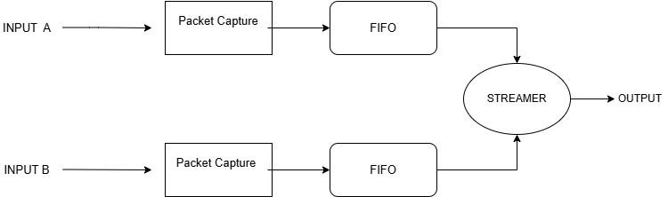

# 🚀 2x2 Ethernet Packet Switch (SystemVerilog)

## 📌 Overview

This project implements a **2x2 packet-based Ethernet switch** using SystemVerilog.
It supports packet capture, buffering using FIFO, routing based on destination address, and arbitration between multiple inputs.

---

## 🏗️ Architecture

---

## 🧠 Modules

* packet_capture → Converts stream into packets
* packet_fifo → Stores packets
* packet_streamer → Handles arbitration
* eth_sw_2x2 → Top module

---

## 🧪 Verification

* Generator
* Driver
* Monitor
* Scoreboard

---

## ▶️ How to Run

cd sim
./run.sh

---

## 📊 Result

All packets routed correctly ✅

##Check the waveform in the images folder
